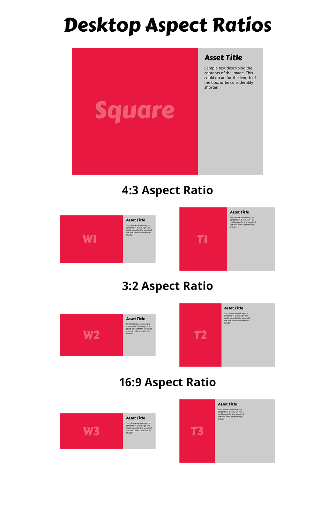

# Media Aspect Ratios

Content uploaded as `ImageAssets` or `EmbeddedAssets`, as well as project attributes such as _hero images_ , on bbncreative will be displayed in a variety of layouts at a variety of sizes. This document specifies those layouts and recommends minimum image dimensions for each aspect ratio.

## Attribute Dimensions
### Hero Image
Project/feed hero images are displayed as follows:
- 100% width and height of the hero frame on mobile viewports
- 70 px short of the hero frame height, and to the right of the bbncreative logo on desktop viewports

On desktop, that window is typically `565px` tall, so the hero image is `495px` tall. The width is half the space outside of the wrapper (i.e. the right hand margin) plus the wrapper, minus the logo space. This is effectively `1000px + the right hand margin`.

Even with a UHD viewport width (`2560x1440`), the hero image is ~1660px wide, so a full HD width should always be enough.

**Recommended dimensions:** `1920px x 565px`

### Logo Image

Project logos are displayed as follows:
- `110px x 110px` with rounded corners on project cards
- `18px x 18px` icon in the Projects menu

**Recommended dimensions:** `110px x 110px`

## Content Aspect Ratios

### ImageAsset
| Code | Name | Ratio | Uses |
|:--:|:--|:--|:--|
| SQ | Square | 1:1 | Instagram photos, logos, assets
| W1 | Wide 1 | 4:3 | Standard screenshots, some photos |
| W2 | Wide 2 | 3:2 | Some photos, good for charts |
| W3 | Wide 3 | 16:9 | Wide screenshots |
| T1 | Tall 1 | 3:4 | Portrait photos |
| T2 | Tall 2 | 2:3 | Portrait photos |
| T3 | Tall 3 | 9:16 | Mobile screenshots |

### EmbeddedAsset
| Code | Name | Ratio | Uses |
|:--:|:--|:--|:--|
| VL | Video Landscape | 16:9 | Landscape Video |
| VP | Video Portrait | 9:16 | Portrait video (e.g. Instagram stories) |
| IG | Instagram Embed | N/A | Embedded Instagram Post |

### Display Modes
Two bases are used for asset display, either side of the width breakpoint `1280px`.
- At widths below the breakpoint:
    - content is `700px` wide
    - text is displayed alongside assets
- At widths including and above the breakpoint:
    - content is `1200px` wide
    - text is displayed below assets

### Resolutions

#### ImageAsset
| Code | Desktop | Mobile | Recommended Upload |
|:--:|:--|:--|:--|
| SQ | 792 x 792 | 700 x 700 | 792 x 792 |
| W1 | 792 x 594 | 700 x 525 | 792 x 594 |
| W2 | 792 x 528 | 700 x 4671 | 792 x 528 |
| W3 | 792 x 4462 | 700 x 3943 | 792 x 446 |
| T1 | 594 x 792 | 700 x 933 | 700 x 9334 |
| T2 | 528 x 792 | 700 x 1050 | 700 x 1050 |
| T3 | 4462 x 792 | 700 x 1244 | 700 x 1244 |

*1) 466.6..., 2) 445.5, 3) 393.75, 4) 933.3...*

**Recommendations:**
- Images at correct aspect ratios only
- Portrait images at least 700px wide
- Landscape images at least 792px wide

## Desktop Asset Board

